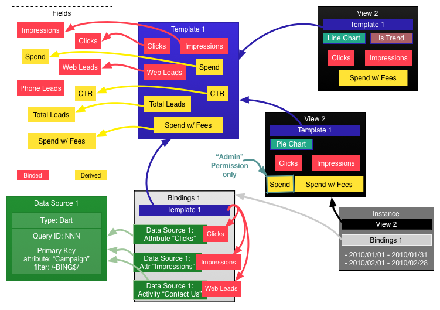

[TOC]

# BRAVO - Reporting (Technical)

## Overview

The goal of URP (unified reporting platform), is to take metrics from third parties, such as Dart (which in turn gets numbers from AdWords and Bing) and Marchex, and generate *unified* reports on them. Reports show metrics for some entities of interest (such as ad campaigns, or ad publishers), with various numbers (metrics) for each, including impressions, clicks, conversions, etc. One of the major motivating reasons behind the creation of URP is adding the ability to distribute fees across report metrics, as Dart does not do this for you today, making URP not only a helpful unified reporting engine, but an essential component in 10TH DEGREE’s services offering. As such, the mechanism behind creating fees and applying them must be robust or it precludes the neccessity of URP entirely.

### Fees

There are two categories of fees we need to work with, **serving** and **agency**. There should be default value for fees within each category if no account level values are specified.

#### Serving Fees

Fees incurred by utilizing a 3rd party ad server (e.g. DoubleClick) to track conversions across multiple channels, publishers, and placements. There are currently two kinds of serving ads, banner ads, and video ads, but there may be others in the future. Fundamentally, there are only two serving fees:

* CPM Fee (cost per 1000 impressions)
* CPC Fee (cost per click)

Since we have two kinds of ads, initially we'll need two sets of the above fees:

* Banner ads
    * CPM Fee: E.g. $0.25 (per 1000 impressions)
    * CPC Fee: E.g. $0.25 (per click)
* Video ads
    * CPM Fee: E.g. $1.00 (per 1000 impressions)
    * CPC Fee: E.g. $0.25 (per click)

In addition, we need a field for specifying when these fees are active (so we can have fees automatically increased/decreased at the start of another billing cycle, etc.).

* Valid Date Range: When these fees should be applied (e.g. 01/2001-01/2010)

#### Agency Fees

Fees charged by us for our services. For this we bill in tiers, usually charging less as more ads are served. However, there is also a minimum fee charged if not enough ads are served. Thus, we minimally have a table of:

* Range (number of impressions, e.g. "0-10000")
* Percentage of Spend (e.g. "15%")

So we know for what quanity of impressions, what percentage of the total spend to apply. However, if there were too few impressions, we want to default to a minimum management fee instead:

* Monthly Management Fee: E.g. $750

Similarly to serving fees, a valid date range for when to apply these fees is needed:

* Valid Date Range: When these fees should be applied (e.g. 01/2001-01/2010)

Like how serving fees has different sets of fees (currently "banner" and "video"), agency fees can have different sets as well. For this, we introduce an arbitrary label (string):

* Label: Different types of agency fees can exist ("display" and "search", for example)

## Reports

Ultimately, an instance of a report (viewed by a user within URP) is composed of one or more rows and one or more columns, forming a grid with the entities of interest forming rows (hereafter "primary keys"), and the metrics/stats forming columns. In order to create such a report in an intelligent manner, it is important to breakdown its construction into reusable components, so we are not reconfiguring the same thing over and over.

We breakdown reports into five parts:

1. Fields (bindable and derived)
2. Templates (field collections)
3. Bindings
4. Views (field visibility)
5. Data Sources



### Fields

A field is essentially a named value or formula (i.e. bindable field or derived field), referencing other field(s) to arrive at its own value. Bindable fields are fields that get their values from an external source, such as Dart or Marchex or account fees; these can be thought of as placeholders that will be filled in later when an instance of a report is generated. (We can further add Gmail style labels to fields so they can be loosely organised if needed.)

#### Formula Engine

We can embed a scripting engine into the formula evaluator so that it is possible to write (when needed) complex expressions using boolean logic (`if (X) Y else Z`) and other functions, like `max()` and `min()`. This allows us to calculate the best spend amount (percentile or minimum agency management fee) entirely in formula, rather than trying to hardcode the logic. This frees the report creator from the software developer.

#### Footers

Each column may have an optional footer, such as `sum(some_field)` or `avg(some_field)`. In addition to this, an option specifying if the footer is based on (client-side, display-level) filtered rows or all rows.

### Templates

We then compose these fields into templates, which is a named collection of said fields. The template should be responsible for checking dependencies to insure that all referenced fields are present and that cycles are not introduced. At this point we still have bindable fields that are unbounded; they are just placeholders that we will fill (bind) later.

### Bindings

We then create an instance of a report by specifying two kinds of bindings: 

1. binding one or more data sources to the template, and
2. binding attributes from any data sources bound in (1) to fields.

This is where we verify that all bindable fields have a corresponding attribute from a data source; if not, an error should be displayed and the report will not be generated.

#### Data Source Bindings

Templates need *data sources* for data. An admin user must select one or more data sources (defined for the account) so that their attributes become available for field binding (see below for both information on data sources and on field bindings).

#### Field Bindings

In the UI there needs to be a way for enumerating and choosing a data source (bound to the template in the step above) and an attribute from it to bind to a field. Multiple data sources can be bound to the same field. However, even if multiple data sources are bound to the same field, they may or may not be combined in the same row; such is up to how primary key definitions are defined for each data source (see below).

**Do we actually want to allow multiple data sources to be bound to the same fields? On the one hand this is nice, but on the other it makes the interface a bit complicated. We could instead allow an admin user to select one or more report bindings when they create an instance of a report; since we know they have the same fields (though bound differently) we could combine the two into a single report.**

### Views

Views specify which fields within a template we want to display in the final report, and which order to display them. Views don't care about bindings at all, only about the fields available within a template. Adding a permission here allows us to make views only visible to users with those permissions. 

Views have a boolean setting for marking them as "comparison" (trend) reports, which allows selection of multiple series (date ranges or accounts) for display. (We could hide the tabular view entirely for comparison reports, or show it in a tabbed form, one tab for each "series" being compared.)

(**Views and templates could be combined if we want a simpler, albeit less flexible solution.**)

#### Charts

One or more charts can be displayed for a report. Each type of chart (line, bar, pie) has slightly different requirements. When configuring the chart, the user selects the default values, and maybe available values so that the viewer can later interact with the chart (such as changing which metric is displayed).

If we use D3.js for charting, we could actually show a third dimension (e.g. size of dots) and do other cool stuff with the charts as well (animations for a fourth dimension, etc.).

**(Charts only need a template to work, not a view, so they could be configured idependently of a view.)**

##### Pie

Only one metric can be displayed for all the primary keys at a time (e.g. "spend" for "campaigns"). Multiple series cannot be shown simultaneously, but multiple pie charts could potentially be shown.

* Domain: primary keys
* Range: target field
* Series: N/A

##### Bar

Allows for simultaneous display of multiple metrics grouped by series. Each series is a primary key.

* Domain: target field(s)
* Range: target field(s) min/max
* Series: primary keys

##### Line

Mostly used for comparisons (?). Tracks date range (or another metric?) vs. some metric. Multiple series can be shown as different lines (e.g. "campaigns" each as a line, or "previous period" vs. "current period").

* Domain: date range
* Range: target field
* Series: primary keys or accounts or date ranges

### Instances

A report instance is just the combination of a Report Binding and a Report View. This allows us to configure more columns than we may need in a single report (template), and then have different views on that data. There is one universal view, which shows all available fields in a single report. (**It would also be possible to create multiple templates instead, if that sounds simpler.**)

#### Viewing Reports

In the UI, then, the user selects from a list of reports they have permissions for, selects a date range (30 days, etc.) and then the system generates that report; hitting the data sources as needed to get the underlying data. 

**TODO: What is the best way to handle requesting arbitrary date ranges from a data-source? We discussed fetching the last 60 or 90 days each day, but if a time frame further back is requested, do we go and grab it?**

#### Comparison (Trend) Reports

Comparison reports work exactly the same way, except the user either:

1. selects two or more date ranges (this may be done automatically, such as selecting the previous time period of the same type, e.g. 30 days, or last month), or
2. selects two or more accounts to compare to one another.

For comparison reports, only charts are really meaningful (?), so the tabular view of the data is not shown.

### Notes on Simplifying types

We could combine Instance/View or Template/View or Instance/Template/View; all of these come with different caveats.

#### Combining Instance/View 

This would be more elbow work for configuration, as now each instance would have to have the fields that want to be shown (are visible) checked for each account. It does not impact cross-account reporting as long as each template represents a unique report (if multiple reports are being created from a single template we'd need to introduce categories/groups here). Permissions on individual fields would still allow users with different permissions to see/not see certain fields or report instances if desired. If mostly you want to show all fields for a template, then the above caveat is not applicable.

#### Combining Template/View

Doing this would mean that more templates would be created, each with fewer fields (as now each template essentially *is* a "view"). This may or may not be desirable; there is no semantic relationship between any of the templates, though one could be devised through a naming scheme or the introduction of categories/groups of some kind. Cross account reporting could still be done for any template in this manner. If we want several views of the same data, this is probably not the thing to do, but if there will usually be a one-to-one relationship, then it could be.

#### Combining Instance/Template/View

This essentially just gives us fields and reports. Now there is no semantic relationship between any reports, so no cross account reporting can be done without  introducing some kind of categories/groupings to associate them (this isn't good though, because they may not have the exact same fields, and we run into the possible of things "blowing up" at runtime). **Not recommended.**

### Report Data Sources

In order to provide data for bindable fields for an instance of a report template, one or more *data sources* must be available. Note that we can treat all data as a data source, with the exception of fees. Currently, only two data source types are needed:

1. Dart
2. Marchex

Each data source type (DST) will have its own configuration properties needed to successfully connect to its respective third party service, such as account ID and query ID. DSTs may have global configuration, such as a user/pass, used for all instances of that data source. Each data source type should optionally define its own global, account, and instance level settings. 

An instance of a data source is essentially responsible for returning a matrix of primary keys with attributes. URP is designed around having metrics for specific dates (individual days) and reportable entities (such as "ad campaigns" or "ad publishers"), i.e. primary keys; therefore every instance of a data source must provide information on these two things so that its data can be combined with other data source data.

#### Dates

(As applicable) each data source *must* provide a column that specifies the date (and its format, e.g. "yyyy/MM/dd") for each row. Without dates the system will not be able to do anything. 

For the Marchex API we always know this field. For Dart it must be provided (though in practice it is always named the same thing?).

#### Primary Keys (reportable entities)

URP expects each row from a data source to provide attributes on a *unique* reportable entity (primary key), but the data from the data source may not be tabulated in this fashion; in fact, on the contrary, the reports that we receive from Dart have a row for each day, and for a combination of potentially many different non primary keys. Once we have created a unique key (or "primary key") for each row, it allows us to combine data from multiple data sources in a seamless manner.

When defining an instance of a data source, an admin user must therefore provide two things: rules, either in the form of string matching or regexes, for how to generate primary keys, and filters for which keys, if any, should simply be dropped from the data before being handed to the report generation engine.

[Regular expressions](http://regexone.com) are ideal for transforming a column value into another value, which then allows us to flatten multiple rows from a data source into a single row in the final report if they have the same transformed value. For example, we select the "publisher" column, and use the regex `"-\s(.*?)$"`, which would match "BING" and "GOOGLE" in the values "Some campaign - BING" and "Some other Campaign - GOOGLE"; it would then sum up all the values for all the rows that it will flatten into each of these two primary keys. **If multiple mappings/transformations may be necessary here, we could introduce a list of rules (regexes) to apply to generate the primary key.**

[Regular expressions](http://regexone.com) can also be used for filtering. If we wanted a report to only contain BING values, we could use the filter regex: `"- BING$"`. 

The report internals are then responsible for coalescing all the data from different data sources into rows based on these filtered primary keys.

**Note that this mechanism of using primary keys allows us to potentially have multiple data sources contributing rows to the same report; it also allows different data sources to contribute *different attributes to the same row* if they produce the same primary key and each have binded fields. If they both provide the same attributes, we could simply sum them.**

#### Caching

Further, we cache data from data sources at this level. A cache repository should be available for data sources to optionally use to cache data instead of fetching it each request. 

Each data source should also be schedulable to run at defined intervals (e.g. every day at 3am). We cache data from data sources rather than just caching the generated reports, because it allows us:

1. to reuse the same underlying data from a data source in multiple reports, and
2. to modify the report template and regenerate the report *without* having to re-request data from the data source.

Since data sources are caching data, they can opt to cache data at a more granular level than what they return through their interfaces. 

#### Dart DS

Dart has global, account, and instance level configuration. At the global level, we must store the developer and secret keys for connecting to the API. At the account level, we need the Dart account ID for each account, and at the instance level, a query id and label for any reports that should be accessible (ideally we would fetch all reports from Dart for that account an enumerate a list that a user can select from, but this feature does not exist in the API today). We may want to dummy fetch a report so we can verify with the user it has the columns they were expecting.

In the case of Dart, an admin user therefore creates one or more instances of a Dart Data Source (one for each Query ID). When binding a data source to a template, the user can select one or more of these.

*When the user selects report bindings, we probably want to allow selection of activities, which though are represented as columns in the report, are probably better selected as the activities themselves. We can achieve this by listing the activities in the dropdown for available attributes (and then any attributes with ":" can be removed from the list, which is Dart's way of listing activities as an attribute name).*

##### Dart Activities

Dart revolves around the concept of activities, which represent conversions of some kind. It is desirable to provide report metrics for specific activities across all accounts (such as "detail page conversion"). However, despite representing the same activity, these values may vary slightly by account (e.g. "Detail page conversions" and "Bob's DP Conversion"). It should be possible to define named categories for activities, and then map these at the field-binding level so we can report on these across accounts, even when the activity name differs from account to account.

**I think we can actually achieve this with the above scheme by creating another bindable field, and binding the activit(ies) of interest to it.**

#### Marchex DS

Marchex has global, account, and instance level configuration. At the global level, we must store user/pass for accessing their API. At the account level, the account ID of the account, and at the instance level a phone number and label. The columns that the Marchex DS provides are hardcoded to the Marchex API. We know in advance all the attributes the API can provide for a phone number.

**TODO: confirm is this is really how the API works**

### URP1 Sample

Example, of how URP1 did field references/formulae specification (extracted into a single place so that it is easily readable):

    AdServingRate = |CpmFee|f
    PpcTrackingRate = |CpcFee|f
    MediaCost = Dart "Media Cost"
    Impressions = Dart "Impressions"
    DynamicClicks = Dart "Clicks"
    Spend = [MediaCost] + ([AdServingRate] * ([Impressions]f / 1000)) + ([PpcTrackingRate] * [DynamicClicks])
    SpendWithFee = [Spend] + (([MediaCost] / [#MediaCost]) * $HighestFee)

Field types:

* `[ABC]`: other field reference, may come directly from Dart or may be a derived field
* `[#ABC]`: sum of all rows for the field [ABC], probably better written as "sum([ABC])"
* `|ABC|`: Database field
* `$HighestFee`: special variable for taking the appropriate value of minimum monthly cost vs. multiplied CPM fee

For URP2, We don't need to introduce so much special notation (or, in fact, really any); `SpendWithFee` from above, can be rewritten as:

    spendWithFee = spend + (mediaCost / sum(mediaCost) * highestFee)

*NOTE: this formula only shows how we would write the same formula from URP1 in URP2, as this formula is actually wrong; the `highestFee` doesn't take into account that the report could span multiple months, so we need to calculate a different `spendWithFee` for each month (see **Fields** section above for proper specification).*

## Formula Evaluation

When generating a report, values get generated by evaluating formulae for each row; thus, the same N formulae get called M times for M rows. This is not a simple process of calling all N formulae, as not only may dependencies exist between the formulae that require processing in a certain order, but summation fields (like `sum()` or `sumMonth()`) require having the values for all rows or a set of rows before being able to provide a value.

We can use an implementation of [javax.scripting](http://docs.oracle.com/javase/6/docs/technotes/guides/scripting/index.html) to expose the needed objects and perform the user defined calculations. Simple formula, such as `impressions / 1000` could be evaluated immediately, but complex expressions that require sums, such as `sum(impressions)` also:

1. require sums to be precalcuated in a previous step, and/or
2. require deferred computation of the expression until those valus become available. 

In either case we will need the AST of the formula expression so we can iterate over the AST to find any aggregate methods, such as `sum(some_field)`, and then ordering the fields based on these extracted dependencies. We will need to do K passes over the data based on the dependencies of the fields. After K passes we have converted the formulae for all fields into concrete values and have a report.

The Rhino JS engine allows access to the AST, so we could do this with JavaScript. In this case, the easiest approach is to use numeric primitives for all variables, and pass strings of the names of variables to aggregate functions so their values can be looked up; we could use an object for all variables rather than primitives, overriding the `valueOf()` method to return a numeric primitive; this hack would allow us to do away with quotes within aggregate functions, as we can ask the object for its name instead, making formula a bit more readable, e.g. `some_field` is a primitive and `sum("some_field")` takes the argument as a string so we can lookup that variable's aggregate value later, vs. `sum(some_field)` where `some_field` is actually an object with a property "name" having the value "some_field" (so we can look up its aggregate value) and also an overridden `valueOf()` method so we can return its value as a primitive within computations.

Alternatively, we could generate our own, simpler AST of the computation, but defer execution of the actual computation until later. We can do this by making all variables objects that when combined return wrapper objects (i.e. makes an AST). Dependency ordering is now even simpler than above as our light-weight AST simply supplies the aggregate functions directly. It also allows us to "build" the computation with the sums, but supply the sum value to use in the computation at a later date (through a kind of reader monad). Ultimately once the sum values have been computed, we execute the delayed computation. In order to the do this in a user-friendly way (e.g. "a + b * c") but still do deferred execution using the [javax.scripting](http://docs.oracle.com/javase/6/docs/technotes/guides/scripting/index.html) API, we will need to use a language that supports operator overloading, so that `a + b * c` actually gets converted (effectively) to `a.add(b.times(c))`, where `a`, `b`, and `c` are not numeric primitives, but objects representing them. This rules out JavaScript, as it only supports operators on primitives; [Groovy](http://groovy.codehaus.org/JSR+223+Scripting+with+Groovy), [Ruby](http://www.oracle.com/technetwork/articles/dsl/jruby-141877.html), and [Scala](https://github.com/scala/scala/pull/2206) [(from 2.11)](http://docs.scala-lang.org/scala/2.11/) are all possibilities, as well as potentially [many others](http://stackoverflow.com/questions/11838369/where-can-i-find-a-list-of-available-jsr-223-scripting-languages).

The second approach allows us to write formulae in the form `sum(spend)` rather than the work around `sum("spend")` *without* resorting to a language hack.

### Serving and Agency Fees

The formula engine must provide access to all the complicated fees defined for an account/globally, or the system will be useless. This gets complicated as fees are often dependent on dates, so reports spanning multiple months (or discrete ranges of different fee values) need to have access to this date information; doing this in an intuitive way to the user is crucial.

#### Example

Since formulae get evaluated for each row, to calculate the proper "spend with fees" we need the date of the current row, and the start and end dates in that same month within the report. `agencyFees("display").monthlyFee()` and `agencyFees("search").percentile()` are functions in this scheme.

```
#!javascript

//// For field "spendWithFees"
var start = row.monthStartDate
var end = row.monthEndDate
var days = row.monthDays
var daysInMonth = row.daysInMonth
var afees = agencyFees("display").monthlyFee(start, end)
var fees = max(
    afees / daysInMonth * days,
    agencyFees("display").percentile(sum(impressions, start, end), start, end) * sum(spend, start, end))
value = fees

// For field "totalSpendWithFees" (or footer for "spendWithFees")
// If we then want the sum of all fees, we just sum that column:
value = sum(spendWithFees)
```

```
#!scala
// If we wanted to get the sum for all the rows otherwise, we'd have to do 
// something like this (rather complicated), which gets total fees for the 
// entire report properly in one go (*not recommended*).
var totalFees = 0
for ((month, days, totalDays, start, end) <- monthsInRange(report.startDate, report.endDate)) 
  totalFees += max(
    agencyFees("display").monthlyFee(start, end) / totalDays * days,
    agencyFees("display").percentile(sum(impressions, start, end), start, end) * sum(spend, start, end))
value = totalFees // set as value
```

Instead of passing start/end dates, we could create functions that implicitly work with these, such as `sumMonth()`, `agencyFees("display").percentileMonth()`, etc. **(If we remove valid start/end dates for fees (and just have a fee) then this gets even easier.)**

```
#!javascript
//// For field "spendWithFees"
// Implicitly use the current row's month info:
value = max(
    agencyFees("display").monthlyFee / row.totalDaysInMonth * row.monthDays,
    agencyFees("display").percentileMonth(sumMonth(impressions)) * sumMonth(spend))
```

*(We can provide auto-complete for expression writing since we know the other available fields.)*

## UI

To take full advantage of Play's features, we probably want to mix ajax/page-reloads, so that each page could be a stand-alone module that does not refresh, but page transitions hit the server.

## Frameworks

### Server

* [Scala](http://www.scala-lang.org)
* [Play! Framework](http://www.playframework.com)

#### User Auth

* Maybe [LDAP in Play! 2](http://java.dzone.com/articles/incorporating-ldap-play-2x)

### UI

* [Angular-js](http://angularjs.org)
* [D3js](http://d3js.org) or initially something super simple, like [Google-charts](https://developers.google.com/chart/)
* [Angular-JS HTTP auth timeout management](https://github.com/witoldsz/angular-http-auth)

And, either [Angular-ui](http://angular-ui.github.io) (Including 
ui-bootstrap, and ui-router) or [Topcoat](http://topcoat.io/).

If you're familiar with jQuery but not Angular-js, [this might be worthwhile to read](http://stackoverflow.com/questions/14994391/how-do-i-think-in-angularjs-if-i-have-a-jquery-background)

We could, also, use [scala-js](http://www.scala-js.org) or [Typescript](http://www.typescriptlang.org) to abstract away having to directly code Javascript, both of these giving us compile time checking of our code.

[This](https://github.com/tastejs/todomvc) is a good comparison of various web frameworks.

## DB

Originally I was thinking to use a document-based database like [MongoDB](http://www.mongodb.org), but the data types have become rather involved, with many relations between each; as such, a relational database is probably better. [Typesafe](http://www.typesafe.com), the creators of [Play!](http://www.playframework.com), also have a framework for working with RDBMS, called [Slick](http://slick.typesafe.com).

For the most part, a pretty normalised schema is fine. For storing report data from data sources, I think we probably want to either:

1. Store each as a converted JSON document along with fields for account, source name, start/end dates. During report generation, the range requested by the user may be longer than any single report request to a data source (such as 6 months, 2 years, etc.), so multiple queries will be necessary to collect all the json documents we need to build the report. We start by breaking the requested interval into months, and pulling the latest report available for that date range. Then we combine the stats from all pulled report objects.
2. We could opt to instead store individual rows of the report data returned by the data sources (still with source name, account, data, and fetch-date). This allows us to simply select the rows for a given date range that have the latest fetch-date, and we would already have all the rows we need. This is nice, but locks us in to storing stats for single days.

## Components

1. Core
    * User
        * Basic (user, pass, etc.) or LDAP/OAUTH needed credentials
        * CanLogin
    * Permissions
        * User
        * Account
        * Permission/Role
    * Account
        * Label
        * Budgets?
2. Reports
    * Field
        * Bindable or derived
        * Label
        * Categories
        * If derived, formula for deriving
        * If bindable, nothing (it's just a labeled container)
        * Optional footer formula (e.g. `sum("a column")`)
    * Report Template
        * Label
        * Collection of fields
    * Report View
        * Label
        * Required user permissions (to see report view)
        * Report template
        * List of visible fields (in display order)
        * Charts
            * (set defaults where appropriate; allow changing during view)
            * Pie
                * Domain: primary keys
                * Range: target field
                * Series: N/A
            * Bar
                * Domain: target field(s)
                * Range: target field(s) min/max
                * Series: primary keys
            * Line
                * Domain: date range
                * Range: target field
                * Series: primary keys or accounts or date ranges
    * Report Bindings
        * Report template
        * Account
        * Field bindings
            * Field
            * Data Source
            * DS Field
        * Data sources
            * Primary key
                * List of regex mappings and filters
    * Report Instance
        * Report template
        * Report bindings
        * Report view
3. Data Sources
    * Sources
        * Dart
            * Configuration
                * Global
                    * API credentials (developer token, etc.)
                * Account
                    * Dart account ID
                    * Available queries (label, query ID)
                    * Available metrics are determined by columns of query (minus activity columns) + activities
        * Marchex
            * Configuration
                * Global
                    * API credentials (?)
                * Account
                    * Marchex account ID
                    * Available metrics (label, phone number)
            * An empty valid date range provides a fallback if a more specific one isn't present
    * Cache Repository Service
        * Simple API so sources can cache data for date ranges
4. Fees
    * Serving
        * A list of ServingFees
            * Optional account (empty if global)
            * Valid date range (e.g. 01/2010-01/2010)
            * Label (e.g. "banner", "video")
            * Cpm
            * Cpc
    * Agency
        * A list of AgencyFees
            * Optional account (empty if global)
            * Valid date range (e.g. 01/2010-01/2010)
            * Label (e.g. "display", "search"): code should enforce that labels exist for global before account
            * List of percentiles (impressions range, percentage)
            * Monthly management fee (e.g. $750)
5. RESTful Service (end-point)
    * Exposes API for front-end to perform CRUD and display